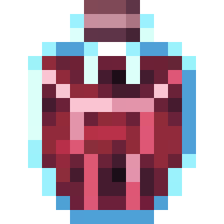
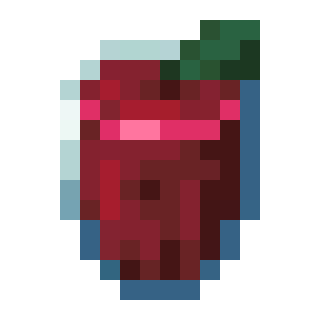
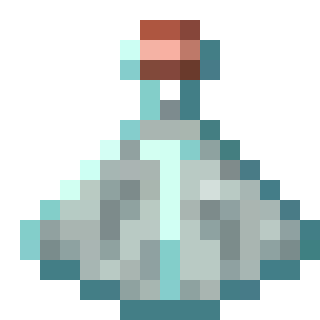
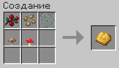

# 🛠🍺 Алкоголь

Этот плагин добавит в игру алкоголь.&#x20;

### Алкоголь

* пиво
* светлое вино
* ягодное вино
* ягодный сок
* ром
* брага
* спирт
* водка
* настойка нюхача
* квас

### Виды получения алкоголя

1. Нахождение в сундуках.
2. Дистилляция через варную стойку.
3. Брожение в бочке. Чтобы бочка стала приспособленной к этому, необходимо "прицепить" медный кран, крафт которого будет состоять из медных блоков. После этого в бочке будет 9 ячеек, в которые надо будет загружать ингредиенты. Для того, чтобы начать брожение, необходимо закрыть бочку при помощи пчелиных сот. Если ингредиенты не те или их мало, то брожение не начнется. После напиток будет в восьми порциях хранится в бочке. Оставшееся время приготовления можно будет узнать, пользуясь нажатием ПКМ часами по бочке. В такой бочке нельзя будет бродить напитки, пока там остался прежний напиток. Если вы сломаете кран, то бочка моментально превратится в обычную, в независимости от того, был ли там напиток или нет.&#x20;

### Механика опьянения

В игре добавится шкала опьянения(в виде босс бара). В зависимости от количества выпитого алкоголя, вы будете получать различные негативные эффекты, которые начинаются от слабости и тошноты, а заканчиваются галлюцинациями в виде мобов. В секунду будет убавляться 0.03% алкоголя "в крови".

### Подробнее о алкоголе



<h2 align="center">Пиво</h2>

Даёт:

* 10% опьянения
* Скорость 2 на 30 секунд

Готовится в бочке 15 минут

Изготовление:

* 32 подсолнуха
* 32 пшеницы
* Спирт



<figure><figcaption></figcaption></figure>






<h2 align="center">Светлое вино</h2>

Даёт:

* 40% опьянения
* Спешка 2 и ночное зрение на 5 минут

Можно найти в сундуках заброшенных шахт



<figure><figcaption></figcaption></figure>






<h2 align="center">Ягодное вино</h2>

Даёт:

* 10% опьянения
* Слабость 1 на минуту

Готовится в бочке 5 минут

Изготовление:

* Ягодный сок
* Спирт



<figure><figcaption></figcaption></figure>






<h2 align="center">Ягодный сок</h2>

Даёт:

* Регенерацию на 10 секунд

Готовится в зельеварке 5 минут

Изготовление:

* 64 сладких ягод
* Бутылёк воды



<figure><figcaption></figcaption></figure>





<h2 align="center">Ром</h2>

Даёт:

* 40% опьянения
* Дельфинью грацию и водное дыхание на 10 минут

Можно найти в сундуках корабля с шансом 30%




<figure><figcaption></figcaption></figure>






<h2 align="center">Спирт</h2>

Даёт:

* 30% опьянения
* Моментальный урон 2&#x20;

Готовится в зельеварке 15 минут

Изготовление:

* 16 ядовитой картошки
* Брага



<figure><figcaption></figcaption></figure>






<h2 align="center">Водка</h2>

Даёт:

* 40% опьянения
* Моментальный урон и сопротивление 2 на 3 минуты

Готовится в бочке 15 минут

Изготовление:

* 16 картошки
* 8 дрожжей(что это такое описано ниже)
* Спирт



<figure><figcaption></figcaption></figure>






<h2 align="center">Настойка нюхача</h2>

Даёт:

* -20% опьянения
* Плавное падение 30 секунд

Готовится в бочке 5 минут

Изготовление:

* 16 факельников
* 16 кувшиниц
* Пузырёк воды



<figure><figcaption></figcaption></figure>






<h2 align="center">Квас</h2>

Даёт:

* 5% опьянения
* Силу 1 на 5 минут

Готовится в бочке 5 минут

Изготовление:

* Пузырек воды
* 16 хлеба
* 8 дрожжей(что это такое описано ниже)




<figure><figcaption></figcaption></figure>






<h2 align="center">Брага</h2>

Даёт:

* 10% опьянения
* Отравление 2 и слепота на 30 секунд

Готовиться в бочке 5 минут

Изготовление:

* Бутылек воды
* 8 дрожей(что это такое описано ниже)
* 16 сахара



<figure><figcaption></figcaption></figure>






<h3 align="center">Дрожжи</h3>

Дрожжи нужны для крафта некоторого алкоголя.



<figure><figcaption></figcaption></figure>



