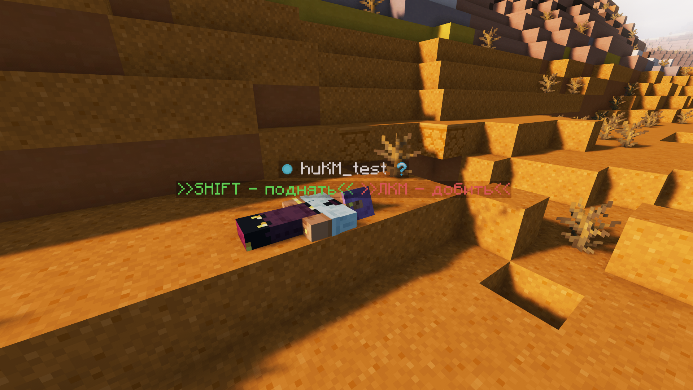
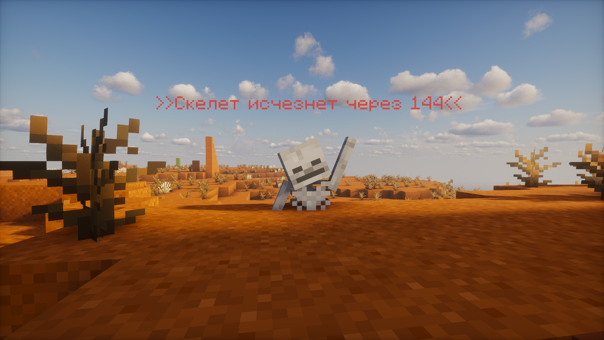

# v1.0💀 Переработка смертей ✅

Теперь вместо того, чтобы сразу умереть от отсутствия здоровья, вы ляжете на землю, при этом не сможете что-либо ломать, ходить и т.д..&#x20;

<figure><figcaption></figcaption></figure>

В таком предсмертном состоянии у вас будет 5 минут на то, чтобы позвать друга и спасти вас, но вы можете не дожидаться этого и умереть, нажав соответствующую кнопку в чате.&#x20;

<figure><figcaption></figcaption></figure>

После смерти, на этом месте появится скелет, который будет хранить все ваши вещи. У вас будет 5 минут, чтобы дойти до скелета и с помощью ПКМ забрать вещи обратно. При этом они вернутся на своё место, но если это сделает другой игрок, то они просто выпадут на землю. **Если на месте старых вещей, появятся новые, то они просто выпадут.** Таймер до исчезновения скелета идет лишь тогда, когда он находится в прогруженных чанках. Если вы не успеете, то вещи просто исчезнут. Также скелет не появится, если вы умрёте в лаве либо пустоте.


Видео-обзор: [https://www.youtube.com/shorts/oVNYKVwFO-0](https://www.youtube.com/shorts/oVNYKVwFO-0)

